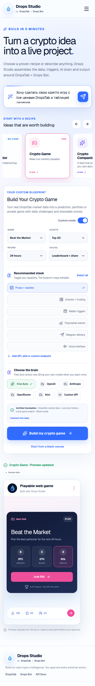

# Drops Studio

Drops Studio is a product-builder MVP for turning a crypto idea into an editable project blueprint powered by DropsTab intelligence, Drops Bot automation, and an AI model chosen by the user.

The interface is intentionally prompt-first: choose one of 12 useful recipes, tune its context-aware settings, or describe a completely custom product. The live preview changes with the recipe and never presents a simulated action as an executed trade.


The mobile builder keeps the same complete workflow and moves the live preview below the editable blueprint.



## What works

- 12 interactive crypto product recipes
- local multilingual prompt classification with no AI key required, or live planning through a connected AI provider
- context-aware configuration for every recipe
- editable custom stack of data, triggers, AI and outputs
- separate previews for briefs, channels, action engines, prediction markets, aggregators, games, companions, radio and voice
- API Vault for DropsTab, Drops Bot, OpenAI, Anthropic, OpenRouter, Kimi and custom OpenAI-compatible endpoints
- real provider key verification through server-side proxy routes
- live DropsTab market mode when a valid user key is connected
- public Polymarket event context through the Gamma API
- browser speech for Crypto Radio and Crypto Siri
- local project drafts through `localStorage`
- responsive desktop and mobile UI

## Product recipes

1. Drops Intelligence-to-Action Engine
2. Alpha Channel Money Machine
3. AI Morning Alpha
4. Prediction-to-Crypto Impact Trader
5. Smart Money Copy Strategy
6. Create Your Crypto Aggregator
7. Build Your Crypto Game
8. Personal Crypto Companion
9. Portfolio Tamagotchi
10. Crypto Product Hunt
11. Crypto Radio
12. Crypto Siri

## Integration boundaries

This MVP only uses capabilities that are already publicly documented or publicly reachable:

- DropsTab data is requested through the documented Public API using the visitor's own API key.
- Drops Bot actions continue in the official Telegram bot. The MVP does not pretend that undocumented remote configuration endpoints exist.
- Polymarket context comes from the public Gamma API.
- AI provider credentials are verified against each provider's official models endpoint.
- No secret is committed, logged, placed in project history or written to `localStorage`. Connected keys live in `sessionStorage` for the current tab.
- No trade is executed without the user continuing to the relevant official product and approving it.

See [docs/INTEGRATIONS.md](docs/INTEGRATIONS.md) for the exact implementation contract.

## Run locally

Requirements: Node.js `>=22.13.0`.

```bash
npm ci
npm run dev
```

Open `http://localhost:3000`.

## Verify

```bash
npm run lint
npm test
```

`npm test` performs a production Vinext build and verifies the rendered product shell.

## Stack

- Next.js 16 / React 19 through Vinext
- TypeScript
- Tailwind CSS v4
- Radix UI primitives
- Framer Motion
- Lucide icons
- Cloudflare Workers-compatible Sites runtime

## Security notes

- Custom model endpoints must be public HTTPS URLs.
- Localhost, loopback, link-local and private-network custom endpoints are blocked.
- Connection checks have a 10-second timeout; AI planning requests time out after 20 seconds.
- API keys are never rendered by the server or included in saved project drafts.

## Brand note

DropsTab and Drops Bot names and marks belong to their respective owners. This repository contains an MVP product concept built around their public product surfaces and documentation.
