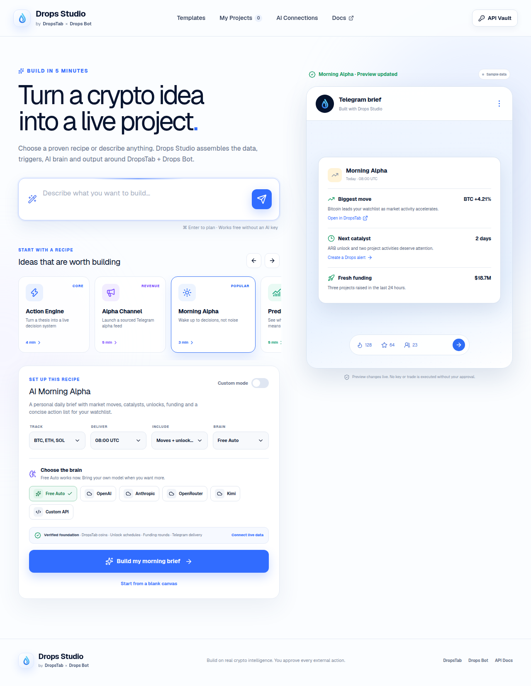
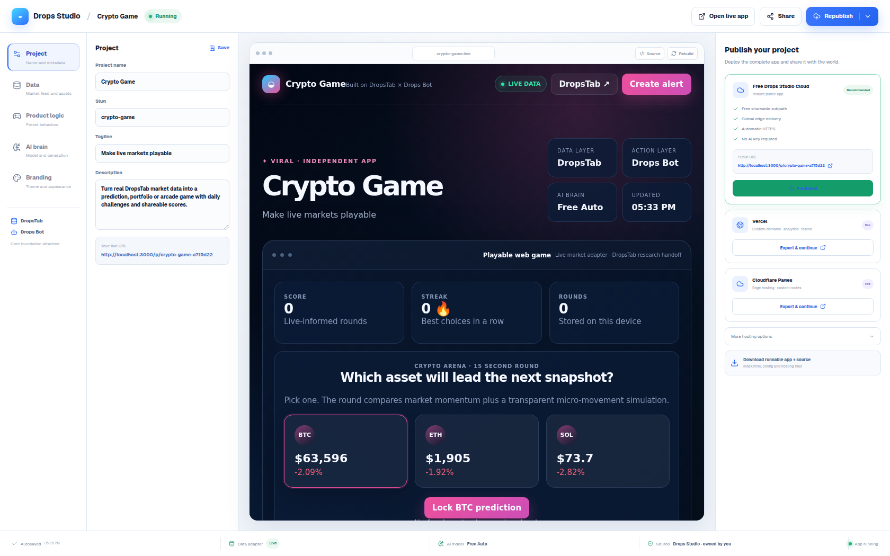

# Drops Studio

Drops Studio turns a crypto idea into a real, editable and publishable product powered by DropsTab intelligence and Drops Bot automation.

The start page is a prompt-first recipe builder. Choose one of 12 products, tune its settings or describe something custom, then build. Drops Studio compiles a standalone application and opens its Project Studio, where the user can run it, change logic and branding, publish a public URL and download the runnable source.





## What works

- output-first intent routing: the requested app type wins while wallet, alert, AI and delivery requirements become capabilities inside it
- 12 distinct standalone crypto product runtimes
- platform-funded guest AI planning with a signed daily quota and a deterministic no-key fallback compiler
- bounded design enhancement through OpenAI, Anthropic, OpenRouter Free, Kimi or a custom OpenAI-compatible model
- universal Experience Director for every recipe: archetype, layout, data view,
  engagement loop, audience, primary loop and editable product modules
- direct Design Mode editing, six curated design kits, responsive preview,
  block variants/visibility, uploaded hero artwork and category-specific chat directions
- explicit Plan and Build Now flows with visible compilation stages
- editable Project Studio for project metadata, data, product logic, AI,
  branding, validated source, release checks and checkpoints
- sandboxed live application preview
- DropsTab Public API production adapter with a 15-minute shared cache, no generated-app polling, user-triggered BYOK snapshots and a clearly labelled public demo fallback
- Drops Bot alert, channel, Telegram and action handoffs
- one-click free public publishing to an anonymous `/p/{slug}` application URL
- deterministic quality gate on every edit and before publishing
- runnable source ZIP with `index.html`, editable project config, integration manifest, quality report, smoke test and Vercel, Cloudflare, Netlify and GitHub Pages files
- local project persistence and automatic migration from the earlier blueprint prototype
- responsive builder, Studio and standalone products

## Product recipes

1. Drops Intelligence-to-Action Engine
2. Alpha Channel Money Machine
3. AI Morning Alpha
4. Prediction-to-Crypto Impact Trader
5. Smart Money Copy Strategy
6. Create Your Crypto Aggregator
7. Build Your Crypto Game
8. Personal Crypto Companion
9. Portfolio Tamagotchi
10. Crypto Product Hunt
11. Crypto Radio
12. Crypto Siri

Each recipe has its own runtime and stateful interaction. Examples include a decision ledger, sourced alpha post composer, searchable market table, playable scored prediction round, local portfolio creature, community voting, browser-speech radio and voice-assisted market answers.

Professional controls are not limited to the game recipe. Changing a data view
actually recompiles eligible products as cards, a table, timeline, graph or
relationship map; changing layout and engagement updates the runtime contract;
and product modules can be added, renamed, reordered or removed in every
category. Uploaded artwork is optimized in the browser and included in the
preview, public application and source ZIP. Every accepted Director or visual
change creates a restorable checkpoint.

## Honest integration boundary

- A visitor may connect a DropsTab API key for documented live data. The key stays in browser session storage and is never compiled, persisted or published.
- A deployment can set `DROPSTAB_API_KEY` server-side so every published app uses the official DropsTab Public API without exposing the key. Without it, apps label the public demo feed as a fallback.
- The platform-owned feed is cached for 15 minutes and targets one shared market request per warm runtime cache window; CDN caching and in-flight de-duplication suppress duplicate traffic. Serverless cold starts, regions and retries mean this is a budget policy, not a false global hard cap. Generated apps do not poll it. A visitor's own key is called only on an explicit connect or refresh action.
- Generated products preserve DropsTab attribution, compatible market data and research links.
- Drops Bot actions continue through the official Telegram product; the app never claims an undocumented remote configuration succeeded.
- Trading-like actions are explicit research, paper-mode or official-product handoffs until the user approves an action in the connected product.
- Connected models return a validated JSON design object. They never author the executable runtime.

See [docs/INTEGRATIONS.md](docs/INTEGRATIONS.md), [docs/PREMIUM_RELEASE.md](docs/PREMIUM_RELEASE.md) and [docs/COMPETITIVE-BENCHMARK.md](docs/COMPETITIVE-BENCHMARK.md) for the product, competitor and security contracts.

## Run locally

Requirements: Node.js `>=22.13.0`.

```bash
npm ci
npm run dev
```

Open `http://localhost:3000`.

## Verify

```bash
npm run lint
npx tsc --noEmit
npm test
```

The production test builds the Cloudflare-compatible application and checks the server-rendered builder and generator contract. Browser QA covers all 12 Build flows, their standalone runtimes, free publishing and the public project route.

## Stack

- Next.js 16 / React 19 through Vinext
- TypeScript and Tailwind CSS v4
- Radix UI, Framer Motion and Lucide icons
- Cloudflare D1 on Sites or Vercel Blob on the public fallback for
  published-project persistence
- Fflate for browser-side runnable source archives
- Cloudflare Workers-compatible Sites runtime

## Brand note

DropsTab and Drops Bot names and marks belong to their respective owners. This public repository is a working product concept built around their public product surfaces and documentation.
