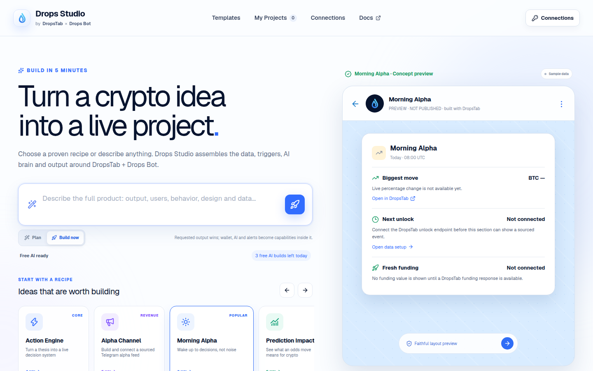
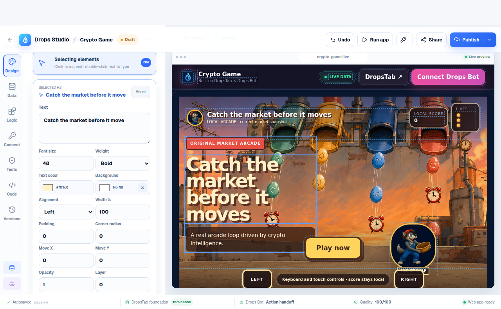

# Drops Studio

Drops Studio turns a crypto idea into a real, editable and publishable product powered by DropsTab intelligence with explicit Drops Bot setup handoffs.

The start page is a prompt-first recipe builder. Choose one of 12 products, tune its settings or describe something custom, then build. Drops Studio compiles a standalone application and opens its Project Studio, where the user can run it, change logic and branding, publish a public URL and download the runnable source.





These two images preserve the current product structure while the automated
visual baselines verify the corrected typography, spacing, targets and
responsive states. Files under `docs/screenshots/` are historical evidence and
must not be used to restore an older editor layout.

## What works

- output-first intent routing: the requested app type wins while wallet, alert, AI and delivery requirements become capabilities inside it
- 12 distinct standalone crypto product runtimes
- platform-funded guest and signed-in member AI planning with explicit daily quotas and a deterministic no-key fallback compiler
- OpenRouter PKCE sign-in with an HttpOnly Studio identity while the provider key remains session-only
- Google OIDC profile sign-in with private project sync and opt-in encrypted,
  account-scoped connection restoration; guests remain session-only
- bounded design enhancement through OpenAI, Anthropic, OpenRouter Free, Kimi or a custom OpenAI-compatible model
- universal Experience Director for every recipe: archetype, layout, data view,
  engagement loop, audience, primary loop and editable product modules
- direct Design Mode editing, six curated design kits, responsive preview,
  block variants/visibility, uploaded hero artwork and category-specific chat directions
- explicit Plan and Build Now flows with visible compilation stages
- editable Project Studio for project metadata, data, product logic, AI,
  branding, a canonical multi-file source workspace with up to six bounded npm
  packages, release checks and checkpoints
- bounded AI source patches with GPT-5.6 Sol first when the platform route is
  configured, a free-model fallback, request-only BYOK and optimistic revisions
- browser live preview plus real root or package-scoped Check, Test, Build and
  Start tasks in an ephemeral Vercel Sandbox Firecracker microVM, with
  stdout/stderr/exit receipts
- DropsTab Public API production adapter with a 15-minute shared cache, no generated-app polling, user-triggered BYOK snapshots and a clearly labelled public demo fallback
- owner-scoped webhook receivers for user-registered Drops Bot callbacks, with
  one-time capabilities, redacted/idempotent events and provider-unverified receipts
- Telegram MTProto channel creation, bot administration and provider-confirmed
  first-post delivery, plus the session-only existing-channel Bot API fallback
- Stripe-backed Pro checkout, billing portal and signed subscription webhooks,
  with provider-confirmed 100-build and 100-sandbox-run daily allowances that
  fail closed to Member
- revisioned team workspaces with one-time invites, validated canonical
  multi-file source, owner/editor writes, and read-only viewer apply when Pro
  billing and durable storage are configured; provider keys, runtime receipts,
  terminal output and compiled HTML never enter the shared draft
- one-click free public publishing to an anonymous `/p/{slug}` application URL
- deterministic quality gate on every edit and before publishing
- runnable source ZIP with the complete editable workspace, exact dependency
  manifest, tasks, `index.html`, project/integration manifests, quality report,
  smoke test and Vercel, Cloudflare, Netlify and GitHub Pages files
- local project persistence and automatic migration from the earlier blueprint prototype
- responsive builder, Studio and standalone products

## Product recipes

1. Drops Intelligence-to-Action Engine
2. Alpha Channel Money Machine
3. AI Morning Alpha
4. Prediction-to-Crypto Impact Trader
5. Smart Money Copy Strategy
6. Create Your Crypto Aggregator
7. Build Your Crypto Game
8. Personal Crypto Companion
9. Portfolio Tamagotchi
10. Crypto Product Hunt
11. Crypto Radio
12. Crypto Siri

Each recipe has its own runtime and stateful interaction. Examples include a decision ledger, sourced alpha post composer, searchable market table, playable scored prediction round, local portfolio creature, community voting, browser-speech radio and voice-assisted market answers.

Professional controls are not limited to the game recipe. Changing a data view
actually recompiles eligible products as cards, a table, timeline, graph or
relationship map; changing layout and engagement updates the runtime contract;
and product modules can be added, renamed, reordered or removed in every
category. Uploaded artwork is optimized in the browser and included in the
preview, public application and source ZIP. Every accepted Director or visual
change creates a restorable checkpoint.

## Honest integration boundary

- A visitor may connect a DropsTab API key for documented live data. The key stays in browser session storage and is never compiled, persisted or published.
- A deployment can set `DROPSTAB_API_KEY` server-side so every published app uses the official DropsTab Public API without exposing the key. Without it, apps label the public demo feed as a fallback.
- The platform-owned feed is cached for 15 minutes and targets one shared market request per warm runtime cache window; CDN caching and in-flight de-duplication suppress duplicate traffic. Serverless cold starts, regions and retries mean this is a budget policy, not a false global hard cap. Generated apps do not poll it. A visitor's own key is called only on an explicit connect or refresh action.
- Generated products preserve DropsTab attribution, compatible market data and research links.
- Drops Bot callback registration continues through the official `@drops` API
  screen until its public documentation exposes a stable registration endpoint;
  the app never claims that an undocumented remote configuration succeeded.
- Trading-like actions are explicit research, paper-mode or official-product handoffs until the user approves an action in the connected product.
- The visual Director returns a validated design object. The source workspace
  path may return only strict create/update/delete file operations; it cannot
  directly invoke commands, install lifecycle scripts, add lockfiles, persist
  secrets or escape through traversal paths. Validated manifest scripts become
  explicit task buttons and run only after a user selects one in the isolated
  sandbox. Every patch is compiled and validated before it becomes a revision.
  Canonical HTML permits only the inert `projectSpec` JSON block and the exact
  local CSS/runtime entries; extra scripts, active embeds, link loads, inline
  handlers, script-scheme URLs and outbound form actions are rejected.
- A multi-package workspace is deliberately bounded: the root manifest may list
  at most six explicit `packages/<safe-name>` directories (never globs or URLs),
  every package manifest stays private, and dependencies/devDependencies use
  exact registry versions. AI revisions allow 24 aggregate dependencies; the
  isolated sandbox accepts at most 64. Canonical source and sandbox input share
  a 1.5 MB total limit.
- Pro and team capabilities activate only from a signed Stripe webhook for the
  exact configured Price. Missing billing, invite or durable-storage secrets
  keep checkout and collaboration visibly unavailable instead of granting a
  client-asserted tier.
- Public builds, root ZIP apps and the generated workspace server enforce
  restrictive, same-origin CSP boundaries. Client ZIP export always records
  provider evidence as `unverified`; browser iframe telemetry is never promoted
  into a DropsTab provider claim.

See [docs/INTEGRATIONS.md](docs/INTEGRATIONS.md), [docs/ACCESS_TIERS.md](docs/ACCESS_TIERS.md), [docs/PREMIUM_RELEASE.md](docs/PREMIUM_RELEASE.md), [docs/COMPETITIVE-BENCHMARK.md](docs/COMPETITIVE-BENCHMARK.md) and [docs/ACCOUNTABILITY_REPORT_RU.md](docs/ACCOUNTABILITY_REPORT_RU.md) for the product, access-tier, competitor, security and process-correction contracts.

## Run locally

Requirements: Node.js `>=22.13.0`.

```bash
npm ci
npm run dev
```

Open `http://localhost:3000`.

## Verify

```bash
npm run guardrails:ui
npm run lint
npm run typecheck
npm run test:unit
npm run build:vercel
npm run build-storybook
npm run test:storybook
npm run test:e2e:prepared
npm run test:lighthouse:prepared
npm run build
```

The release pipeline checks the split UI policy, Storybook states, Axe,
console/runtime failures, horizontal overflow, the current workspace
architecture, all 12 native products, public game/radio/Telegram proof flows,
the Vercel build, Lighthouse budgets and the Cloudflare-compatible Sites build.
Visual baselines are never updated without explicit approval.

## Stack

- Next.js 16 / React 19 through Vinext
- TypeScript and Tailwind CSS v4
- shadcn CLI v4 local components on Base UI 1.6, bounded legacy Radix
  primitives, short Framer Motion transitions and Lucide icons
- Cloudflare D1 on Sites or Vercel Blob on the public fallback for
  published-project persistence
- Vercel Sandbox for isolated Node 24 task execution with network-denied runtime
  and registry-only dependency installation with install scripts disabled
- Fflate for browser-side runnable source archives
- Cloudflare Workers-compatible Sites runtime

## Brand note

DropsTab and Drops Bot names and marks belong to their respective owners. This public repository is a working product concept built around their public product surfaces and documentation.
